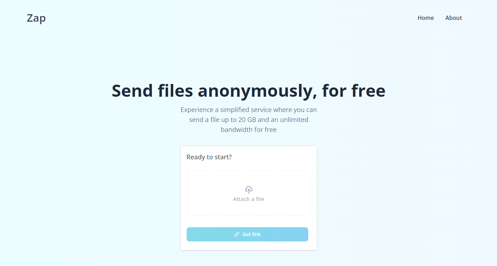

# Zap
A simple, easy to use and private file sharing service which utilizes the AnonFiles API service.

## Preview

## Built With
* React
* Next.js
* TailwindCSS
* TypeScript

## Versioning
We use [SemVer](http://www.semver.org) for versioning. For the versions available, see the [tags on this repository](https://github.com/icabetong/zap/tags)

## License
This project is licensed under the MIT - see the license file for more details

## Forking/Cloning
Please review the [license](https://github.com/icabetong/zap/blob/main/LICENSE) and remove all of my personal information (resume, images, etc.).
